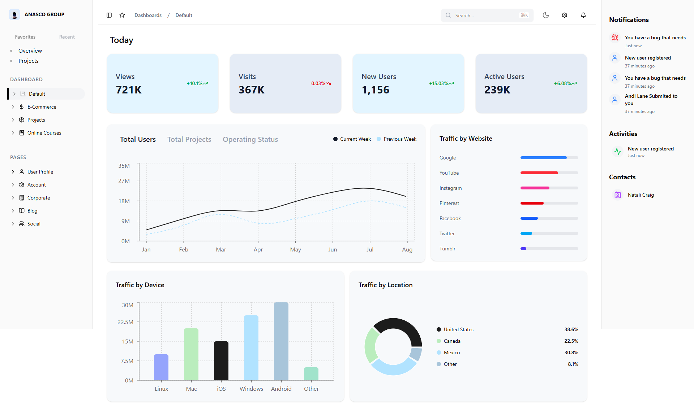

# Front-End Technical Task – Dashboard

This is a front-end technical task built using Next.js, TypeScript, Tailwind CSS, and shadcn/ui.  

---

## Tech Stack Used

- Next.js (App Router)
- TypeScript
- Tailwind CSS
- shadcn/ui
- Recharts (for charts)
- Lucide-react (for icons)
- next-themes (for dark/light mode)

---

## Features Implemented

- Sidebar navigation
- Top navigation bar with search and icons
- Dark/Light mode toggle (using next-themes and custom context)
- Stats cards (Views, Visits, New Users, Active Users)
- All charts implemented using Recharts (line, bar, etc.)
- Notifications sidebar with static mock data

---

## Folder Structure

Inside the `src` folder:

- `components/` – All reusable UI components
- `context/` – Context (e.g., theme)
- `providers/` – Providers (e.g., theme)
- `types/` – TypeScript types
- `data/` – Local mock data

---

## Live Demo

[Live Demo](https://anasco-dashboard.vercel.app)

---

## Screenshot

